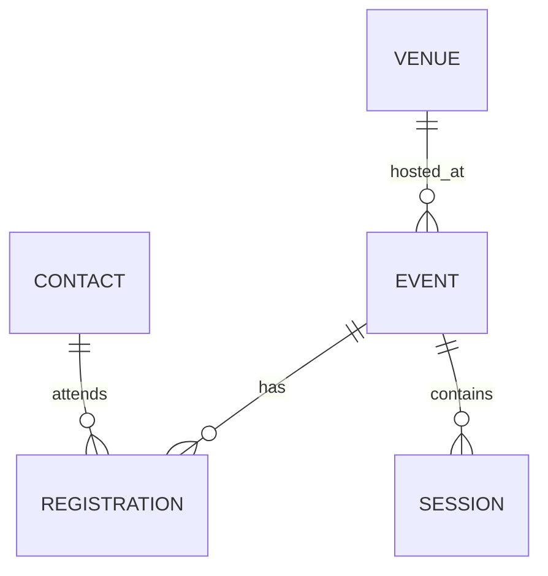

# Data Model — EventEase

## Core Entities (Recommended)
- Event__c: Represents an event.
- Registration__c: Junction between Contact (Attendee) and Event__c.
- Session__c (optional MVP): Child of Event for agenda items.
- Venue__c: Venue/location details.
- Contact (standard): Represents attendee; may hold interests/preferences.

Optional Normalization (Phase 2):
- Topic__c and Event_Topic__c (junction) for normalized event topics.
- Interest__c to capture Contact interest in topics with weights.

## Key Fields (MVP)

Event__c
- Name (Auto Number or Text)
- StartDateTime__c (DateTime), EndDateTime__c (DateTime), Timezone__c (Text)
- Venue__c (Lookup to Venue__c)
- Capacity__c (Number), RemainingCapacity__c (Roll-Up)
- Status__c (Picklist: Planned, Published, Closed, Cancelled)
- EventType__c (Picklist), Price__c (Currency), CurrencyIsoCode (if multi-currency)
- Topics__c (Multi-Select Picklist)
- Description__c (Long Text)
- BannerImage__c (File or URL), External_URL__c (URL)

Registration__c
- Name (Auto Number)
- Contact__c (Lookup Contact), Event__c (Lookup Event__c)
- Session__c (Lookup Session__c, optional)
- Status__c (Picklist: Registered, Waitlisted, Cancelled, Attended, No-Show)
- Source__c (Picklist: Web, Onsite, On-Behalf, API)
- QRCode__c (Text/URL), CheckInTime__c (DateTime)
- PaymentStatus__c (Picklist: N/A, Pending, Paid, Failed), AmountPaid__c (Currency)

Session__c (Optional)
- Name (Text), Event__c (Lookup)
- StartTime__c (DateTime), EndTime__c (DateTime)
- Speaker__c (Lookup Contact), Room__c (Text)
- Capacity__c (Number)

Venue__c
- Name (Text)
- Street, City, State, PostalCode, Country (Address fields)
- GeoLocation__c (Geolocation)
- Notes__c (Long Text)

Contact (Attendee)
- Email, Phone, MobilePhone
- Interest_Topics__c (Multi-Select Picklist)
- Marketing_Opt_In__c (Checkbox)

## Relationships
- Contact 1–* Registration__c *–1 Event__c
- Event__c 1–* Session__c
- Venue__c 1–* Event__c

## ER Diagram (Mermaid)

Note: In Salesforce, custom objects would be `Event__c`, `Registration__c`, `Session__c`, and `Venue__c`. Mermaid labels are simplified (CONTACT, EVENT, etc.).

## Sharing & OWD (Draft)
- Event__c: Public Read/Write (or Read-only) to enable visibility, with edit controls via permissions.
- Registration__c: Private (PII). Access via role hierarchy, criteria-based sharing, or apex sharing to organizers.
- Session__c, Venue__c: Read/Write for organizers/admins.

## Rollups
- RemainingCapacity__c on Event__c = Capacity__c - count(Registration__c where Status in Registered/Attended).
- Attendance rate and revenue rollups for dashboards.
